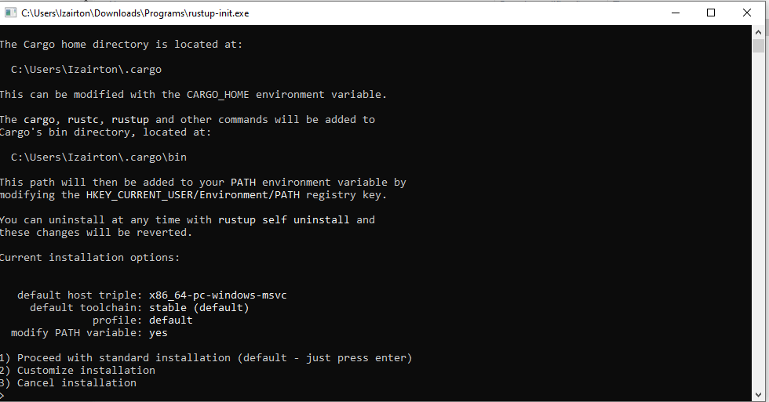
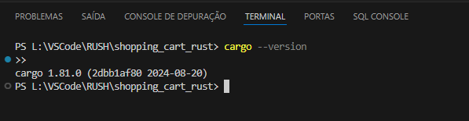
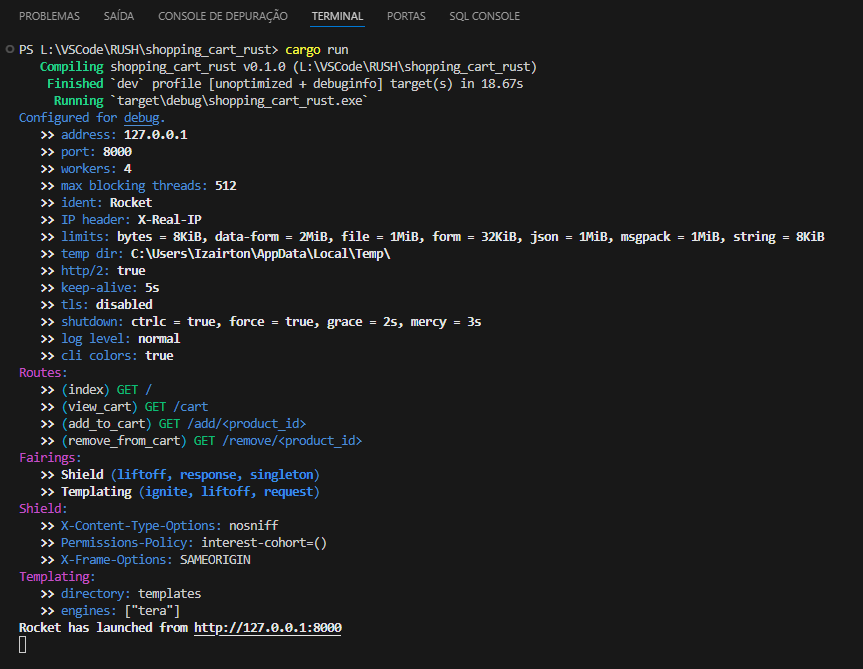

# Carrinho de Compras com Rust e Rocket

## Sobre o Projeto

Este projeto implementa um carrinho de compras simples utilizando Rust e o framework Rocket. Ele permite aos usuários visualizar produtos, adicionar e remover itens do carrinho.

### Objetivos

- Demonstrar a aplicação de Rust e Rocket em um ambiente de servidor web.
- Implementar operações básicas de um carrinho de compras.
- Utilizar templates Tera para renderizar páginas HTML dinamicamente.

### Tecnologias Utilizadas

- **Rust**: Linguagem de programação focada em segurança e performance.
- **Rocket**: Framework web para Rust que facilita a escrita de código web seguro sem sacrificar a flexibilidade.
- **Tera**: Mecanismo de template para Rust usado para criar layouts HTML dinâmicos.

### Estrutura do Projeto

O projeto está organizado da seguinte forma:

    /shopping_cart_rust
    |-- Cargo.toml             # Arquivo de configuração do projeto e dependências
    |-- Cargo.lock             # Snapshot das dependências do projeto
    |-- src/
        |-- main.rs            # Arquivo principal que inicia o servidor web Rocket
        |-- routes.rs          # Definições das rotas da aplicação
        |-- cart.rs            # Lógica de manipulação do carrinho de compras
        |-- products.rs        # Gerenciamento e configuração dos produtos disponíveis
        |-- models.rs          # Modelos de dados utilizados
    /-- templates/             # Templates Tera para renderização das páginas
        |-- index.tera         # Template para a listagem de produtos
        |-- cart.tera          # Template para exibir o carrinho de compras
    README.md                  # Este arquivo

### Instalação e Configuração

#### 1. Instalação do Rust

Certifique-se de ter o Rust instalado. Caso ainda não tenha, siga o processo de instalação abaixo.

#### 2. Versão do Rust

Verifique se a instalação foi bem-sucedida executando o comando `rustc --version` no terminal. Deve retornar algo semelhante à imagem abaixo:

#### 3. Projeto Iniciado e Servidor Rodando

### Configurações e Comandos

- **Configuração do Cargo.toml**:
  Certifique-se de que todas as dependências estão listadas corretamente no `Cargo.toml` do projeto.

- **Comandos para execução**:
  - `cargo run` — Compila e executa o servidor Rocket.
  - `cargo build` — Compila o projeto sem executar.

### Como Usar o Aplicativo

1. Inicie o servidor utilizando o comando `cargo run`.
2. Abra um navegador e acesse `http://127.0.0.1:8000/` para visualizar a lista de produtos.
3. Utilize as rotas `/add/<product_id>` e `/remove/<product_id>` para adicionar ou remover produtos do carrinho.

### Recomendações Futuras

- **Adicionar Autenticação**: Implementar autenticação de usuários para personalizar carrinhos.
- **Persistência de Dados**: Integrar um banco de dados para persistir os dados dos produtos e do carrinho.
- **Melhorias na UI**: Desenvolver uma interface mais robusta usando frameworks de front-end como React ou Vue.js.

### Leitura Adicional

- [The Rust Programming Language Book](https://doc.rust-lang.org/book/) — Um recurso abrangente para aprender Rust.
- [Rocket Documentation](https://rocket.rs/v0.5-rc/guide/) — Guia oficial para o framework Rocket.
- [Tera Documentation](https://tera.netlify.app/docs/) — Documentação para o motor de templates Tera.

### Contribuições

Contribuições são sempre bem-vindas! Veja `CONTRIBUTING.md` para saber como começar.

### Licença

Distribuído sob a Licença MIT. Veja `LICENSE` para mais informações.

---

**Nota**: Este README é apenas um modelo inicial. Adapte-o conforme necessário para seu projeto específico.
